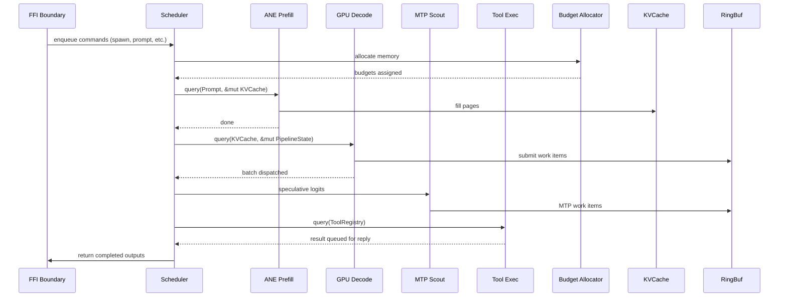

# Prism ECS Architecture

## Motivation

Prism manages `n` concurrent agents (target 50-500) each running a ternary-quantized inference pipeline with ANE prefill, GPU decode, CoreAudio streams, and tool execution. Current `OpaqueMultiplexer` is a monolithic struct with per-agent session objects — O(n) iteration, scattered memory access, manual budget allocation. ECS formalizes what already exists into cache-friendly SoA storage with query-based system scheduling.

## Entity

```rust
pub struct Entity(pub u32);
```

A session identifier. No behavior, no data. Allocated by `World::spawn()`, recycled by `World::despawn()`. The u32 maps directly to the agent_id in the FFI `prism_execute_multimodal` call.

## Components

| Component | Storage | Fields | Written by | Read by |
|---|---|---|---|---|
| `Prompt` | `Vec<Prompt>` | `tokens: Vec<u16>`, `modality: Modality` | FFI recv | ANE prefill |
| `KVCache` | `Vec<KVCache>` | `pages: Vec<PageIndex>`, `seq_len: u32`, `budget_gb: f32` | ANE prefill | GPU decode |
| `PipelineState` | `Vec<PipelineState>` | `phase: Phase`, `generated: u32`, `mtp_head: u8` | GPU decode | System scheduler |
| `ToolRegistry` | `Vec<ToolRegistry>` | `tools: Vec<Tool>`, `pending_tool: Option<ToolCall>` | LLM output | Tool executor |
| `AudioStream` | `Vec<AudioStream>` | `buffer: RingBuf`, `wake_word: bool`, `slc_offset: u64` | CoreAudio | ANE prefill |
| `MemoryBudget` | `Vec<MemoryBudget>` | `slc_mb: u32`, `gpu_mb: u32`, `ane_ops: u32` | Budget sys | All systems |

All components are stored as flat `Vec<Component>` indexed by entity ID. `SparseSet<Component>` for optional components. No `HashMap` — iteration is linear memory access.

### SoA vs AoS

AoS (array of structs) would pack unrelated fields together. SoA (struct of arrays) separates hot/cold:

```rust
// SoA storage — each field is its own Vec
struct PipelineStateStorage {
    phases: Vec<Phase>,
    generated_tokens: Vec<u32>,
    mtp_heads: Vec<u8>,
}
```

One 256-byte cache line holds 64 phase enums instead of striding across 4 disparate fields. On M1's 128 KB L1 per core, a 256-agent sweep fits entirely in L1.

## Systems

Each system is a standalone function: `fn run(world: &mut World, resources: &Resources)`. Resources are singletons (GPU command buffer, ANE context, SLC allocator).

| System | Frequency | Query | Output |
|---|---|---|---|
| ANE prefill | On prompt arrival | `(Prompt, &mut KVCache)` + `Resource<ANEPool>` | Fills KV cache pages |
| GPU decode | Every token step | `(KVCache, &mut PipelineState)` + `Resource<MetalDispatch>` | Emits logits |
| MTP scout | After GPU decode | `(KVCache, &PipelineState)` + `Resource<MetalDispatch>` | 4 speculative logit heads |
| Tool executor | After decode complete | `(ToolRegistry,)` + `Resource<ToolRuntime>` | Executes pending tool |
| Budget allocator | On spawn / resource change | `(KVCache,)` + `Resource<MemoryBudget>` | Rebalances SLC/GPU budgets |
| Budget reaper | Every 100ms | `(KVCache,)` + `Resource<MemoryBudget>` | Evicts idle KV pages |

## Scheduler

The scheduler runs a fixed pipeline per frame:



The ring buffer (already implemented in `kernels.rs`) becomes the system-to-GPU command channel. Systems write work items; the GPU consumes them.

## Integration with existing code

Current `OpaqueMultiplexer` methods map directly:

| Current | ECS equivalent |
|---|---|
| `multiplexer.create_session(config)` | `world.spawn((KVCache::new(config), PipelineState::new()))` |
| `multiplexer.submit_prompt(entity, prompt)` | `world.insert(entity, Prompt { tokens, modality })` |
| `multiplexer.tick()` | `scheduler.run(&mut world, &resources)` |
| `multiplexer.free_session(entity)` | `world.despawn(entity)` |

## Implementation strategy

**Phase 1 — Component storage** (next work session):
- Add `world.rs`: `Entity`, `World` with `SparseSet`-backed component storage
- Keep `OpaqueMultiplexer` as a thin wrapper calling `World` methods
- No behavioral change — just reorganize memory layout

**Phase 2 — Systems** (after Phase 1 verified):
- Extract `ane_prefill_system`, `gpu_decode_system`, etc. from current monolithic tick
- Add query objects: `Query<(A, &mut B)>` that returns `(Entity, A, &mut B)` tuples
- Wire the ring buffer as a system-to-GPU resource

**Phase 3 — Scheduler** (after Phase 2 verified):
- Replace `tick()` with a `Schedule` that sequences systems by dependency
- Add async completion handling (MPSC channel from GPU callback -> main loop)
