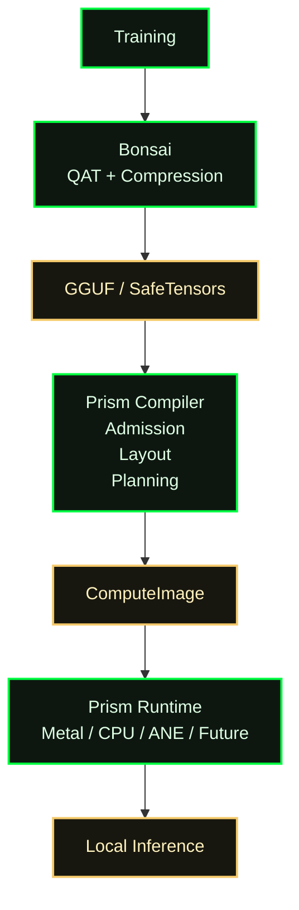
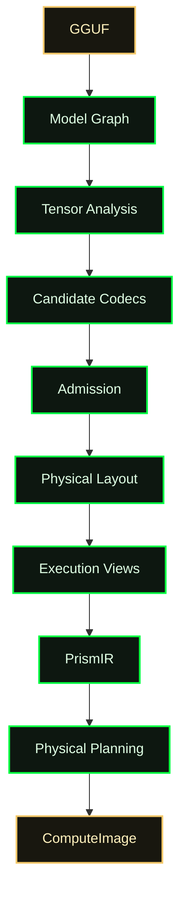
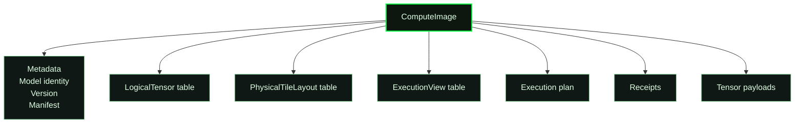
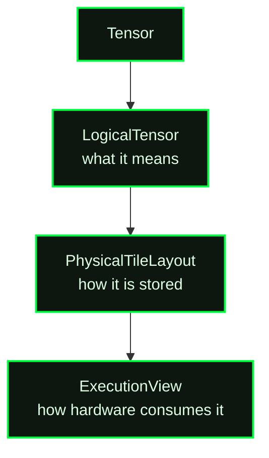
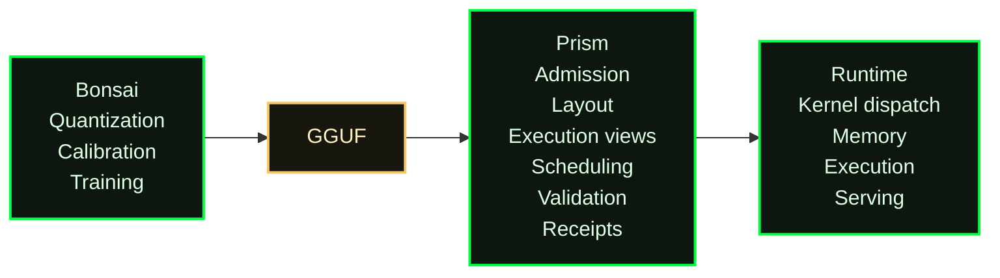
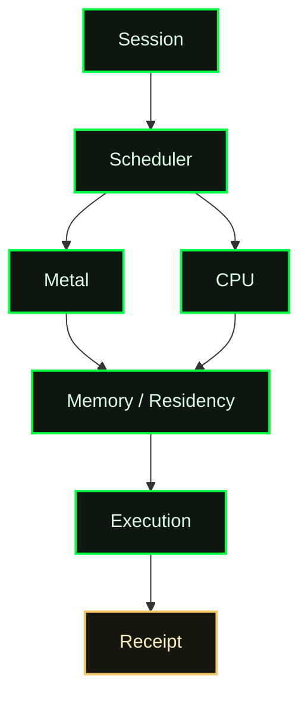
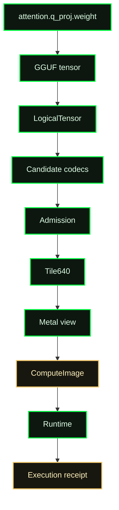

# Prism Engine and Bonsai

## Two adjacent layers of one local-inference stack

### Technical brief for engineering review

Status: working architecture brief  
Audience: engineering leadership and systems engineers  
Repository: `Tribunus-dev/prism-engine`  
Date: July 2026

## Executive summary

Bonsai optimizes models for efficient numerical representation. Prism optimizes those models for efficient execution on heterogeneous hardware. Together they form adjacent stages of the local-inference deployment pipeline.

Prism takes model artifacts such as GGUF or SafeTensors, analyzes the model graph and its tensors, chooses storage and execution representations for a target machine, and emits a self-contained ComputeImage (`.cimage`). The runtime loads that image and executes it through target-specific backends, with Apple Silicon and Metal as the primary path today.

Bonsai and Prism address adjacent stages of the same deployment problem. Bonsai’s center of gravity is training and quantization: producing a model whose numerical behavior survives compression. Prism’s center of gravity is deployment and execution: turning that compressed model into a hardware-aware artifact with layouts, execution views, scheduling decisions, validation evidence, and a runtime path that does not need to parse or compile the original model at inference time.

The resulting relationship is complementary. Bonsai can produce a high-quality quantized model; Prism can consume that model and compile it into a device-oriented execution artifact. Prism does not need to replace Bonsai’s quantization or retraining work, and Bonsai does not need to own the device scheduler, cimage layout ABI, heterogeneous placement, or runtime evidence chain.

The central technical idea is to separate three decisions that are often collapsed into one model file: what the tensor means, how its bits are physically stored, and how a particular execution lane consumes them. In Prism, these are represented as a logical tensor, a physical tile layout, and one or more execution views. This lets the same model artifact be adapted to different Apple Silicon memory and accelerator profiles without changing the model’s logical graph.

The practical outcome is a deployment contract that can be inspected, validated, replayed, and compared. The output is not merely a set of weights. A cimage carries the information required to explain how those weights are intended to execute, which choices were admitted, and what evidence supports them.



The figure is the short version of the document: Bonsai improves the model representation; Prism turns that representation into an executable deployment artifact.

The architectural slogan is simple: modern model formats often conflate model semantics, physical representation, and execution strategy. Prism makes those three concerns explicit and independently inspectable.

## Engineering principles

| Principle | Meaning in Prism |
|---|---|
| Compiler-first | Deployment decisions are made during compilation rather than rediscovered at runtime. |
| Immutable deployment artifacts | A promoted cimage is versioned and identified by its exact contents and provenance. |
| Inspectable decisions | Representation, layout, execution-view, planning, and validation choices are visible in manifests and receipts. |
| Backend below semantic planning | Device-specific lowering implements a verified execution plan without redefining its semantics. |
| No hidden runtime mutation | Runtime caches and handles may optimize execution, but they cannot silently change canonical admission, ownership, placement, or outcome. |

## 1. The problem Prism solves

Deploying a modern model locally is not only a matter of loading weights into a matrix-multiplication library. The deployment system must reconcile model semantics, compressed representations, memory capacity, accelerator-specific layouts, scheduling, KV-cache residency, thermal and bandwidth constraints, and numerical quality.

Those concerns become especially visible on Apple Silicon. CPU, GPU, unified memory, cache hierarchy, and Neural Engine capabilities are physically close but operationally different. A representation that is compact may still be expensive to decode. A layout that is efficient for one kernel may be poorly aligned with another. A model that fits in memory may still create unacceptable scratch-buffer or KV-cache pressure. A runtime that discovers all of these decisions at request time pays the cost repeatedly and makes the resulting behavior difficult to reproduce.

Prism moves the expensive and consequential decisions into compilation. The compiler reads the source model, builds a model graph, evaluates candidate codecs and layouts, selects target-compatible execution views, and seals the result into a versioned artifact. Runtime then operates on the artifact rather than rediscovering the model’s deployment strategy.

From the user’s perspective, the workflow is simple: pull or provide a model, compile it, inspect the result, and run or serve it locally. Internally, the workflow is a compilation pipeline with explicit admission and evidence boundaries.

```text
GGUF / SafeTensors
        │
        ▼
Model identity and graph ingestion
        │
        ▼
Tensor analysis and candidate generation
        │
        ▼
Codec + tile layout + execution-view admission
        │
        ▼
PrismIR optimization and physical planning
        │
        ▼
Versioned ComputeImage (.cimage)
        │
        ▼
Target runtime: Metal / CPU / future accelerator lanes
```

## 2. Architecture at a glance

Prism has three cooperating layers. The compiler is responsible for turning source weights and model metadata into a cimage. The execution-planning layer represents computation and execution semantics before backend lowering. The runtime maps the sealed plan to available devices, manages memory and scheduling, dispatches kernels, and records terminal execution evidence.

The layers are intentionally separated. The compiler owns source-weight interpretation and representation selection. The planner owns execution relationships such as placement, communication, storage, synchronization, validation, and publication. The runtime owns the operational mechanisms that carry out an admitted plan. Backend handles remain implementation resources; they are not permitted to become an alternate source of canonical model or execution state.

| Layer | Responsibility | Typical Prism surface |
|---|---|---|
| Model ingestion and compiler | Read GGUF or SafeTensors, construct the model graph, analyze tensors, choose representations, assemble the image | `prism compile`, `compile_to_cimage`, `prism-gguf`, `prism-ecs-compile` |
| Execution semantics and planning | Represent compute, communication, storage, decisions, synchronization, validation, and publication; optimize and verify before physical mapping | PrismIR v1, capability manifests, physical plans |
| Runtime and evidence | Load cimages, resolve residency, schedule work, dispatch Metal or CPU execution, expose serving APIs, and persist receipts | `prism run`, `prism serve`, runtime scheduler, receipt and evidence stores |

The CLI exposes the lifecycle directly. `prism compile` creates the deployment artifact, `prism inspect` explains its contents, `prism calibrate` and admission commands expose quality and representation decisions, and `prism run` or `prism serve` executes the compiled result.



This answers the compiler question: Prism transforms a source model into a sealed artifact through explicit representation, planning, and validation stages.

## 3. The ComputeImage contract

A cimage is Prism’s deployment artifact. It is designed to be loadable by a fresh runtime without the original float model or a just-in-time compiler. The artifact contains model identity, graph and tensor metadata, payload segments, layout descriptions, execution plans, target profiles, and the evidence needed to understand why the artifact was admitted.

An engineer should be able to see those decisions directly. The following is a representative `prism inspect` view for the artifact produced by the intended Bonsai 27B workflow; the exact counts and target name will be populated by the executable demo rather than treated as fixed architectural constants.

```text
$ prism inspect bonsai-27b.cimage
Model:
  bonsai-27b
Source:
  bonsai-27b-q2_0.gguf
Target:
  Apple M1 Max
Logical tensors:
  912
Execution views:
  Metal: 912
  CPU fallback: 912
Tile families:
  Tile640 NF4
  Tile640 INT8
  FP16
Receipts:
  Compiler       ✓
  Admission      ✓
  Validation     ✓
```

The point of this output is not the particular number of tensors or codecs. It is that the deployment artifact is inspectable: the model identity, source identity, target, logical graph surface, execution views, physical families, and qualification evidence are visible before inference begins.



This answers the storage question: a cimage is a deployment artifact with metadata, representation tables, an execution plan, evidence, and payloads—not just a renamed weight file.

The cimage layout ABI separates three representations of a tensor.

Every tensor exists simultaneously in three forms: what it means, how it is stored, and how hardware consumes it. Prism names those forms so that a compiler decision can be inspected without confusing model semantics with a backend layout.



`LogicalTensor` describes what the tensor means in the model. It records an identifier, class, shape, logical operation, data type, orientation, and graph boundary. For example, a decoder projection can be identified as a matrix whose input axis is the reduction axis and whose output axis is the accumulation axis. This information is semantic and remains stable even if storage changes.

`PhysicalTileLayout` describes how the tensor is stored. It records the codec, tile family, tile shape, group size, group axis, metadata layout, padding policy, alignment, and interleave. This is where Prism can distinguish, for example, NF4 packed into Tile640 blocks from an INT8 or contiguous FP16 representation. The group axis is explicit because a quantized tensor’s grouping convention is part of the kernel contract; it cannot safely remain an implicit assumption.

`ExecutionView` describes how hardware consumes the physical representation. A tensor may have a Metal fused-decode view, a CPU fallback view, or an ANE-compatible view. Each view identifies its data and metadata offsets, codec overrides, whether repacking is required, and its residency mode. A target profile can select which views are resident or mutually exclusive without changing the logical tensor.

This separation is important for Bonsai integration. A GGUF can be treated as the source representation and preserved as provenance, while Prism creates one or more cimage views optimized for the deployment target. The quantized values remain attributable to the source model, but their physical organization becomes an explicit deployment decision.

## 4. What is technically novel in Prism

Prism’s novelty is not a claim that quantization, graph compilation, or device scheduling is individually new. The distinctive architecture is the way these concerns are connected through a single, inspectable deployment contract.

### 4.1 Information-guided admission rather than a global precision switch

Prism does not treat the model as if every tensor has the same sensitivity or should use one global bit width. Its calibration and admission surfaces measure tensor information content and compare candidate representations against numerical gates. The compiler can then choose among codecs such as NF4, INT8, Tile640 variants, FP16, or higher-precision fallbacks according to the tensor’s role and measured behavior.

Candidate representations are evaluated using information-theoretic metrics, but admission is ultimately governed by explicit engineering thresholds.

Admission is therefore a compiler gate, not a post-hoc benchmark label. A candidate that fails the declared cross-entropy or validation policy is rejected or retained only as an explicitly non-production experiment. This makes it possible to compare representation choices while preserving the distinction between a promising candidate and a qualified deployment artifact.

### 4.2 Layout as a first-class ABI

Quantization decides how many bits are stored. Layout decides whether those bits arrive in the right lane, in the right order, with the metadata the kernel expects. Prism makes this distinction explicit.

Tile families, group axes, metadata placement, alignment, padding, and execution views are part of the cimage contract. This lets the compiler select a storage layout that matches a fused Metal kernel or a target memory profile without pretending that storage order is an incidental implementation detail.

The result is a clean boundary between model semantics and accelerator-facing organization. It also gives Bonsai a stable place to hand off a quantized model: Bonsai can optimize the numerical representation, while Prism can optimize how the representation is packed, mapped, and scheduled.

### 4.3 Execution semantics before physical backend lowering

PrismIR represents execution semantics before physical planning. Its vocabulary covers computation, communication, storage, execution decisions, synchronization, validation, and publication. Semantic transformations such as fusion, streaming conversion, KV residency changes, or synchronization elimination occur before a plan is bound to a particular device.

This is the architectural reason Prism can describe heterogeneous deployment without embedding every hardware vendor’s behavior into the model graph. Capabilities describe what a provider can do; PrismIR describes what the workload requires; physical planning chooses a legal composition. Adding a new provider should produce a new physical or lowering artifact without requiring the semantic pipeline to change.

### 4.4 Evidence as part of the artifact lifecycle

Prism treats receipts and evidence as first-class outputs. Compilation, admission, backend lowering, validation, and execution each have identities and results that can be persisted and resolved. In practice, a promoted cimage can be traced back to its source model, compilation choices, target capabilities, validation evidence, and runtime execution.

This matters operationally. If a performance result or numerical discrepancy is reported later, the system has a basis for reconstructing which model bytes, compiler rules, target profile, and execution plan produced it. A build log can tell an engineer that a command ran; a receipt can tell them what was admitted and why.



This is the ownership boundary: Bonsai owns training-time model quality and compression; Prism owns deployment-time representation admission and execution policy; the runtime carries out the resulting plan.

## 5. Runtime architecture

At runtime, Prism coordinates a heterogeneous set of execution lanes over a shared model artifact. The primary accelerated path is Apple Metal, with a portable CPU path under continued hardening. ANE/Core ML and additional accelerator paths are represented as development surfaces with different maturity levels; the cimage and planning contracts are designed to accommodate them without requiring one universal kernel implementation.

```text
                    ┌──────────────────────────┐
                    │ Session / serving API    │
                    └────────────┬─────────────┘
                                 │
                    ┌────────────▼─────────────┐
                    │ Canonical work + policy  │
                    │ admission and ownership  │
                    └────────────┬─────────────┘
                                 │
                    ┌────────────▼─────────────┐
                    │ Heterogeneous scheduler  │
                    │ placement, copies, KV    │
                    └──────┬────────┬──────────┘
                           │        │
                  ┌────────▼───┐ ┌──▼──────────┐
                  │ Metal GPU  │ │ CPU / ANE   │
                  │ fused ops  │ │ fallback    │
                  └──────┬─────┘ └──────┬──────┘
                         └──────┬───────┘
                                ▼
                    ┌──────────────────────────┐
                    │ Execution + terminal     │
                    │ receipt / evidence       │
                    └──────────────────────────┘
```

The scheduler reads workload requirements and device capabilities, inserts transfers at explicit memory boundaries when required, resolves tensor residency, and coordinates execution. The runtime’s caches, queues, and hardware handles are derived mechanisms. Canonical state such as accepted work, model identity, ownership, committed KV changes, and terminal outcomes belongs to the governed execution layer.



The same architecture can express a single-Mac path or a distributed composition. The Bonsai heterogeneous-serving fixture demonstrates the latter conceptually: the serving requirement remains fixed while capability descriptions can cause prefill, KV transfer, decode, and streaming to be assigned to different providers. On a local Mac, the same planning idea can choose between GPU, CPU, and future ANE lanes based on memory, latency, compatibility, and validation metadata.

## 6. Current state of implementation

The table below describes what an engineer should expect from the repository today. A check mark means the surface exists in the current codebase and is exercised on its supported path; it does not mean every model family or backend is production-ready.

| Component | Status | Boundary |
|---|---|---|
| GGUF ingestion | Implemented | Local GGUF path; feature-gated compilation support |
| CImage compiler | Implemented | Rust compiler and ECS assembly surfaces |
| CImage inspector | Implemented | `prism inspect` and related inspection binaries |
| Metal runtime | Implemented | Primary accelerated Apple Silicon path |
| Tile640 layouts and kernels | Implemented / active | Target- and tensor-class-specific coverage |
| CPU backend | Active hardening | Functional portable path; not equivalent maturity to Metal |
| ANE backend | Experimental | Planning and integration surfaces are present; coverage varies |
| AMD backend | Development surface | Capability/planning work; not a uniformly supported production path |
| Intel backend | Development surface | Capability/planning work; not a uniformly supported production path |
| Distributed runtime | Prototype | Heterogeneous planning and coordination fixtures exist; production readiness varies |

The immediate meeting demo should stay within the first five rows: a Bonsai-exported GGUF compiled and inspected on Apple Silicon, followed by local Metal execution. The remaining rows explain the extensibility boundary without implying that all target families are equally runnable today.

## 7. Why Prism is complementary to Bonsai

Bonsai and Prism should be described as layers with a deliberate handoff, not as competing inference engines.

| Concern | Bonsai contribution | Prism contribution |
|---|---|---|
| Training and adaptation | QAT, calibration strategy, and model-quality optimization | Consumes the resulting model artifact and preserves its provenance |
| Numerical compression | Learns or selects quantization behavior that preserves model quality | Tests candidate deployment representations against admission gates |
| Model artifact | GGUF or related quantized checkpoint | Target-specific cimage with layouts, views, plans, and evidence |
| Hardware mapping | May expose a model intended for efficient inference | Chooses tile layouts, residency, scheduling, and backend views |
| Runtime execution | Model behavior and quality remain the source concern | Executes the sealed image through Metal, CPU, or other lanes |
| Operational confidence | Quality of the trained/quantized model | Reproducible compilation, validation, inspection, and execution receipts |

The cleanest integration boundary is the model artifact plus its metadata and quality contract. Prism should not reinterpret Bonsai’s QAT as if it were a runtime scheduling policy. Conversely, Bonsai should not need to know the details of every device queue, memory tier, tile ABI, or backend receipt. Each system can remain excellent at its own layer while making the handoff explicit.

The joint story is therefore: Bonsai improves the model’s numerical efficiency; Prism turns that efficient model into an executable deployment image. Bonsai supplies the learned or selected quantization behavior. Prism supplies target-aware packing, execution planning, and a runtime contract that can be inspected on the machine where inference occurs.

## 8. Why Prism is a compiler rather than an inference runtime

Existing inference engines generally load a model and derive some execution strategy dynamically. Prism treats deployment as a compilation problem rather than primarily as a kernel-dispatch problem. An existing inference engine can be an excellent execution backend, but Prism’s central contract is different: representation admission, tensor layout planning, execution-view selection, residency planning, scheduling metadata, validation, and artifact sealing happen once during compilation.

The runtime therefore executes a precomputed deployment contract rather than reconstructing the model’s deployment strategy on every load. This makes the result inspectable and reproducible. It also gives Prism a stable place to reason about heterogeneous placement, memory residency, target-specific views, and validation evidence before a backend is selected.

This is not an assertion that existing runtimes lack sophisticated kernels or graph optimization. It is a distinction in architectural ownership. Prism can use or replace backend mechanisms below the planning boundary while keeping the deployment artifact, admission policy, and evidence chain under one compiler contract.

## 9. A concrete model-to-receipt walkthrough

Consider a Bonsai 27B model exported as a GGUF for local deployment. Follow one tensor, `attention.q_proj.weight`, from source bytes to execution. The exact codec and execution choices are target- and evidence-dependent, but the stages are the compiler’s concrete handoff points.

```text
Bonsai 27B GGUF
        │
        ▼
Read tensor: model.layers.0.self_attn.q_proj.weight
        │
        ▼
LogicalTensor
  shape, operation, axes, tensor class, graph boundary
        │
        ▼
Candidate representations
  NF4, INT8, FP16
        │
        ▼
Admission
  NF4       accepted by the declared quality gate
  INT8      rejected for this tensor / policy
  FP16      retained as a fallback or comparison candidate
        │
        ▼
PhysicalTileLayout
  Tile640, group size, group axis, metadata, alignment
        │
        ▼
ExecutionView
  MetalFusedDecode   primary Apple Silicon view
  CPU fallback        portability / diagnostic view
        │
        ▼
ComputeImage (.cimage)
  tensor identity + layout + offsets + plan + evidence
        │
        ▼
Metal scheduler
  residency → dispatch → synchronization → output
        │
        ▼
Execution receipt
  artifact identity + target + plan + validation + outcome
```



At ingestion, Prism records the source model and tensor identity rather than treating the GGUF as an opaque blob. The compiler then constructs a `LogicalTensor` that says what the projection does and which axes matter. It evaluates candidate representations against the declared admission policy. If NF4 passes for this tensor while INT8 does not improve the relevant tradeoff, the compiler records that decision rather than leaving it as an undocumented runtime heuristic. It then resolves the accepted representation into a `PhysicalTileLayout`, creates the target-specific `ExecutionView`, and stores the payload and descriptors in the cimage.

At load time, the runtime does not rediscover the tensor’s quantization or layout. It resolves the admitted view, establishes the required residency, dispatches the corresponding Metal path, and associates the outcome with the cimage and target identity. The important property is the preservation of identity across the flow: the original tensor remains identifiable as a model tensor, its physical representation is explicit, the selected execution view is named, and the final runtime outcome can be associated with the exact artifact and validation evidence. The walkthrough is concrete without claiming that every model or tensor will receive the same NF4, Tile640, or fallback decision.

### Why this matters operationally

Because deployment decisions are explicit and sealed into the artifact, engineers can compare two cimages generated from the same source model, understand why they differ, reproduce historical deployments, and investigate performance or numerical regressions without reconstructing undocumented runtime heuristics.

## 10. The proposed technical review flow

The most productive meeting is a design review centered on one model and one deployment path. Begin with the source artifact and its quality assumptions. Show how Prism identifies the model and constructs its graph. Then inspect a small number of representative tensors and follow each one from logical identity through codec admission, physical layout, execution view selection, and runtime dispatch.

The discussion should then move from individual tensors to execution semantics. Show which stages are fused or streamed, where KV state lives, which device lane owns each phase, and which transfers are inserted. Finally, inspect the resulting cimage and its evidence chain. The objective is not to enumerate every subsystem. It is to establish that the architecture is coherent, that the handoff from Bonsai is well-defined, and that the resulting deployment behavior is explainable and reproducible.

The central review question is:

> Can a Bonsai-produced quantized model be compiled into a Prism ComputeImage whose numerical contract, physical layout, execution plan, and validation evidence are all explicit enough for an engineer to reproduce and inspect the deployment on a local Mac?

That question gives the meeting a concrete technical spine and provides a natural test for the demo and documentation.

## 11. Current implementation boundaries

Prism is pre-1.0 research and systems software, and the maturity boundary should be explicit. Apple Silicon compilation and Metal execution are the primary supported paths and the ones appropriate for a local Mac demonstration. Linux CPU execution is functional and under active hardening. AMD, Intel, NVIDIA, Tenstorrent, ANE, and distributed execution are represented by planning and capability interfaces, but remain development surfaces rather than uniformly supported production backends.

The architecture should be presented with that maturity distinction intact. Prism can already demonstrate the compilation and execution contract on its primary path. Some heterogeneous planning and accelerator integrations are architectural or experimental surfaces whose value is the stable planning boundary, not a claim that every provider is production-ready today.

The same applies to formal verification. PrismIR has structural verification and conservative equivalence reporting, along with transformation and backend receipts. This is a strong reproducibility and review mechanism, but it should not be described as a complete formal proof of semantic equivalence across all backends.

## 12. Performance evidence

Performance numbers should come from the same clean-Mac workflow Karim would run, not from estimates embedded in the architecture brief. The demo should record the source model digest, target identity, compiler feature set, compile wall time, peak compile memory, cimage size, load/startup latency, resident memory, and prompt/decode throughput. Those values belong in the execution receipt or an attached benchmark report so they remain tied to an exact artifact.

This brief intentionally does not invent those measurements. Once the demo is run on a fixed Apple Silicon target, the resulting numbers can be inserted here without changing the architecture narrative.

## 13. Quick Start

The shortest path for an engineer with an Apple Silicon Mac is to build the CLI, compile a local GGUF, inspect the resulting image, and run it. The exact feature set depends on the selected build and the model family, so the commands below are the repository’s canonical shape rather than a claim that every arbitrary GGUF is already supported.

```bash
git clone https://github.com/Tribunus-dev/prism-engine
cd prism-engine

cargo build --release -p prism-engine --features "gguf-compile,metal-dispatch"

# Compile a local Bonsai-exported model. GGUF compilation requires the
# gguf-compile feature shown in the build command above.
cargo run --release -p prism-engine --features "gguf-compile,metal-dispatch" --bin prism -- \
  compile /path/to/bonsai-model.gguf

# Inspect the sealed deployment artifact.
cargo run --release -p prism-engine --features "gguf-compile,metal-dispatch" --bin prism -- \
  inspect ~/.prism/models/<model-name>/model.cimage

# Run local inference.
cargo run --release -p prism-engine --features "gguf-compile,metal-dispatch" --bin prism -- \
  run <model-name>
```

The inspect step is part of the intended workflow, not merely a debugging convenience. It should expose the compiled model identity, selected representations, layout and execution metadata, and available evidence so that an engineer can understand what Prism produced before starting inference.

## 14. Recommended integration contract

The near-term integration contract between Bonsai and Prism should be deliberately small. Bonsai supplies a versioned model artifact, model metadata, tokenizer or preprocessing identity, quantization configuration, and a quality or calibration manifest. Prism accepts that input, records its digest, compiles it into a target-specific cimage, and emits a manifest describing the selected codecs, layouts, execution views, target profile, and validation evidence.

The cimage should remain independently runnable and inspectable. The runtime should not require Bonsai to be present, should not need to reconstruct the original quantization process, and should not silently substitute a different source artifact. If a target-specific view or kernel is unavailable, the result should be an explicit fallback or admission failure with a receipt, not an undocumented runtime mutation.

This contract leaves room for a later tighter loop. Bonsai could use Prism’s per-tensor deployment evidence to identify hardware-sensitive tensors or layouts. Prism could consume richer Bonsai quality metadata to prioritize candidate admission and avoid repeating experiments. The systems would then form a feedback loop between learned compression and measured deployment behavior without collapsing their responsibilities.

## 15. Conclusion

Prism and Bonsai independently occupy adjacent parts of the same stack. Bonsai’s work makes a model smaller and more numerically efficient. Prism makes that model executable as a target-aware, inspectable, and evidence-bearing deployment artifact.

The strongest technical case for Prism is the coherence of the boundary: logical tensors remain model semantics; physical tile layouts make compression and memory organization explicit; execution views adapt those layouts to lanes; PrismIR keeps execution planning above backend lowering; and receipts connect compilation choices to validation and runtime outcomes.

That is the level at which the systems become interesting together. The integration is not “Bonsai exports weights and Prism runs them.” It is a shared architecture in which training-time quantization and deployment-time compilation meet at a precise artifact boundary, allowing each system to improve the part of the stack it understands best.

## Appendix A. Repository references

This brief is grounded in the repository’s current architecture and design documents: [`README.md`](../README.md), [`cimage-layout-abi-v1.md`](cimage-layout-abi-v1.md), [`prism-ir-v1.md`](prism-ir-v1.md), [`prismir-paper-draft.md`](prismir-paper-draft.md), [`bonsai-heterogeneous-demo.md`](bonsai-heterogeneous-demo.md), [`adr-027-memory-model.md`](adr-027-memory-model.md), and [`adr-005-ecs-native-compiler-absorption.md`](adr-005-ecs-native-compiler-absorption.md).
